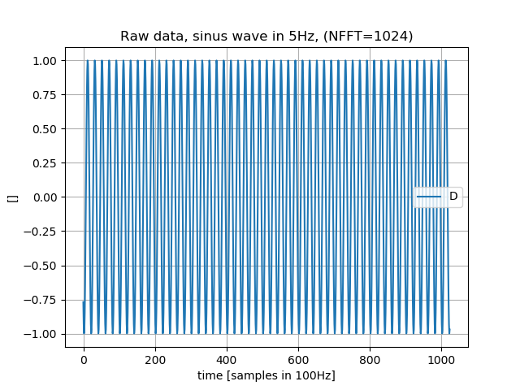
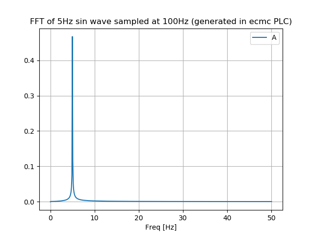
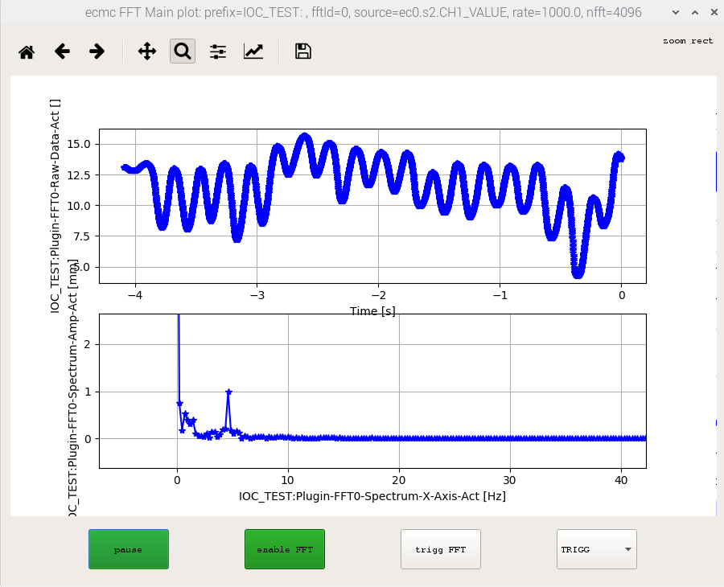
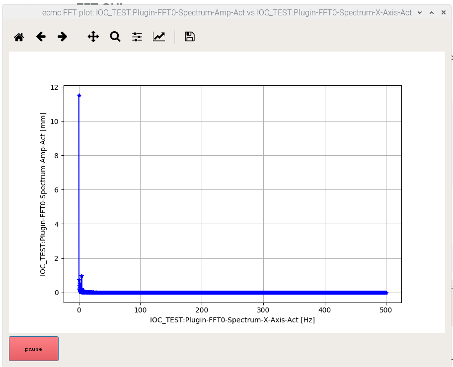
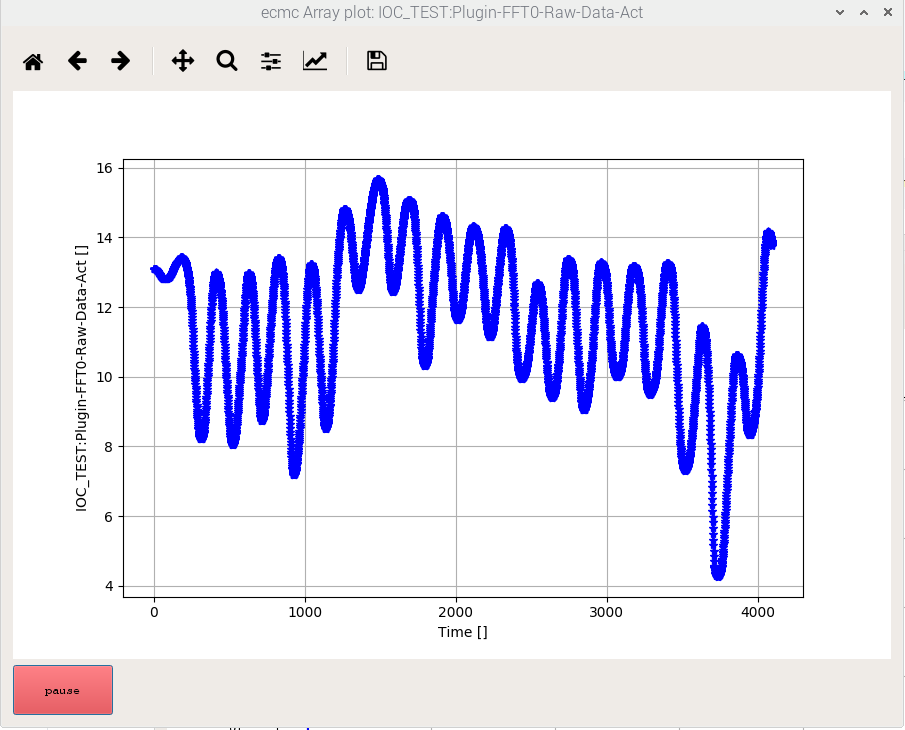

e3-ecmc_plugin_fft
======
ESS Site-specific EPICS module : ecmcPlugin_FFT

A shared library with FFT functionalities loadable into ecmc:

https://github.com/epics-modules/ecmc (or local ess fork https://github.com/icshwi/ecmc).

Configuration is made through ecmccfg:

https://github.com/paulscherrerinstitute/ecmccfg (ot local ess fork https://github.com/icshwi/ecmccfg)

FFT:s are calculated with the kissfft lib:
https://github.com/mborgerding/kissfft


# Introduction

The main functionality of this plugin is to make FFT analysis of ecmc data. Most data in ecmc is accessible:
1. EtherCAT data  ("ec0.s1.AI_1" or "ec0.s2.mm.CH1_ARRAY")
2. Motion data    ("ax1.actpos")
3. PLC data       ("plcs.plc0.static.testvalue")

Precautions have been taken in order to disturb ecmc real time thread as little as possible:
1. All CPU intensive calculations are handled in a low prio work thread (not ecmc thread).
2. Communication to epics is made via a dedicated asynPortDriver (not the same that ecmc uses).

See below for configuration options and the different modes supported by this ecmc plugin.

## Loading of FFT plugin in ecmc: 
A plugin is loaded by the ecmccfg command loadPlugin:
https://github.com/icshwi/ecmccfg/blob/master/scripts/loadPlugin.cmd

Example:
``` 
 ${SCRIPTEXEC} ${ecmccfg_DIR}loadPlugin.cmd, "PLUGIN_ID=0,FILE=libecmcPlugin_FFT.so,CONFIG='DBG_PRINT=1;SOURCE=ax1.actpos;RM_LIN=1;', REPORT=1
 dbLoadRecords(ecmcPluginFFT.template,"P=$(IOC):,INDEX=0, NELM=${FFT_NELM}")
```
This plugin supports multiple loading. For each load of the plugin a new FFT object will be created. In order to access these plugins, from plc:s or EPICS records, they can be accessed by an index. The first FFT plugin will have index 0. The next loaded FFT plugin will have index 1...

Note: If another plugin is loaded in between the loading of FFT plugins, it will have no affect on these FFT indexes (so the FFT index is _not_ the same as plugin index).

## Configuration

The different available configuration settings:
* SOURCE= source variable    : Sets source variable for FFT (example: ec0.s1.AI_1). This config is mandatory.
* DBG_PRINT=1/0    : Enables/disables printouts from plugin, default = disabled.
* NFFT= nfft       : Data points to collect, default = 4096.
* SCALE=scale      : Apply scale to input data, default = 1.0.
* RM_DC=1/0        : Remove DC offset of input data (SOURCE), default = disabled.
* RM_LIN=1/0       : Remove linear component input data (SOURCE), default = disabled.
* ENABLE=1/0       : Enable data acq. and calcs (can be controlled over asyn), default = disabled.
* MODE=CONT/TRIGG  : Continious or triggered mode, defaults to TRIGG
* RATE=rate in hz  : fft data sample rate in hz (must be lower than ecmc rate and (ecmc_rate/fft_rate)=integer), default = ecmc rate.
* BREAKTABLE= EPICS breaktable : Apply breaktable to raw value.

Example configuration string:
```
"SOURCE=ax1.poserr;MODE=TRIGG;DBG_PRINT=1;ENABLE=1;"
```

#### SOURCE (mandatory)
The data source is defined by setting the SOURCE option in the plugin configuration string.
This configuration is mandatory.

Example: Axis 1 actpos (See RM_LIN config below)
```
"DBG_PRINT=1;SOURCE=ax1.actpos;RM_LIN=1;"

```
Example: Ethercat slave 1 analog input ch1
```
"DBG_PRINT=1;SOURCE=ec0.s1.AI_1;"
```
#### DBG_PRINT (default: disabled)
Enable/disable printouts from plugin can be made bu setting the "DBG_PRINT" option.

Example: Disable
```
"DBG_PRINT=0;SOURCE=ax1.poserr;"
```

#### NFFT (default: 4096)
Defines number of samples for each measurement.

Note: Must be a n² number..

Example: 1024
```
"NFFT=1024;DBG_PRINT=0;SOURCE=ax1.poserr;"
```
#### SCALE (default 1.0)
Apply custom scale to input data.

Example: 5.0
```
"SCALE=5.0;NFFT=1024;DBG_PRINT=0;SOURCE=ax1.poserr;"
```
### RM_DC
Remove DC of input signal. Default is disabled.

Example: Remove DC offset
```
"RM_DC=1;SCALE=1;NFFT=1024;DBG_PRINT=0;SOURCE=ax1.poserr;"

```
### RM_LIN
Remove linear component of input signal. Default is disabled.
The linear component is calculated by least square method.
Could be usefull for values that increase, like actual position.

Example: Remove linear component
```
"RM_LIN=1;SCALE=1;NFFT=1024;DBG_PRINT=0;SOURCE=ax1.poserr;"
```
#### ENABLE (default: disabled)
Enable data acq. and FFT calcs. The default settings is disabled so needs to be enabled from plc or over asyn in order to start calculations.

Example: Enable at startup by config
```
"ENABLE=1;RM_DC=1;SCALE=1;NFFT=1024;DBG_PRINT=0;SOURCE=ax1.poserr;"
```
Example: Enable FFT index 0 from EPICS:
```
caput IOC_TEST:Plugin-FFT0-Enable 1
```
Example: Enable FFT index 0 from ecmc PLC code:
```
fft_enable(0,1)
```

#### MODE (default: TRIGG)
The FFT module can operate in two different modes:
* CONTINIOUS (CONT)
* TRIGGERED (TRIGG)

Continious mode:
1. Clear data buffers 
2. Wait for enable (from plc or asyn/epics record or configuration(see above))
3. Data acqusition starts 
4. When buffers are full a worker thread will be triggered to calculate the FFT.
5. FTT results are sent by callback over asyn to epics records
6. goto 1.

Note: data will be "lost" during calculation time.

Triggered mode:
1. Clear data buffers 
2. Wait for enable (from plc or asyn/epics record or configuration(see above))
3. Wait for trigger (from plc or asyn/epics record)
3. Data acqusition starts 
4. When buffers are full a worker thread will be triggered to calculate the FFT.
5. FTT results are sent by callback over asyn to epics records
6. goto 1.

Example: Mode triggered
```
"MODE=TRIGG;ENABLE=1;RM_DC=1;SCALE=1;NFFT=1024;DBG_PRINT=0;SOURCE=ax1.poserr;"
```
Example:  Mode from EPICS record
```
# CONT
caput IOC_TEST:Plugin-FFT0-Mode-RB 1
# TRIGG
caput IOC_TEST:Plugin-FFT0-Mode-RB 2
```
Note: The record is a output record with readback so can both be read and written to.

#### RATE (default: the ecmc rate of the selected data source)
Sets the sample rate of the raw input data (from data source). The default value is the ecmc rate for that data source.
Note: only a lower and "integer" division of sample rate can be defined.

Example: Rate = 100Hz
```
"RATE=100;MODE=TRIGG;ENABLE=1;RM_DC=1;SCALE=1;NFFT=1024;DBG_PRINT=0;SOURCE=ax1.poserr;"
```

#### BREAKTABLE (default: no break table)
 
Note: The break table must be added in EPICS

Example: Apply BREAKTABLE=typeTelemess33020_21877 to raw value
```
"...;BREAKTABLE=typeTelemess33020_21877;"
```

Example: Load custom breaktable in EPICS
```
dbLoadRecords ./bptBreakTable.dbd
```

Example: breaktable (in a bptBreakTable.dbd)
```
  # <raw> <eng>
  breaktable(typeTelemess33020_21877) {
	  2502.48 0
	  4058.89 1.5
    6164.64 3
    8880.74 4.5
    11993.57 6
    15259.00 7.5
    18371.84 9
    21271.05 10.5
    24658.54 12
    27344.13 13.5
    29297.28 15
  }

```

## EPICS records
Each FFT plugin object will create a new asynportdriver-port named "PLUGIN.FFT<index>" (index is explaine above).
The reason for a dedicated asynport is to disturb ecmc as little as possible.
The plugin contains a template file, "ecmcPluginFFT.template", that will make most information availbe from records:
* Rawdata array                    (ro)
* FFT amplitude array (result)     (ro)
* FFT x axis (frequencies)         (ro)
* Status                           (ro) 
* Mode                             (rw)
* Sample rate                      (ro)
* Enable cmd                       (rw)
* Trigger cmd                      (rw)
* NFFT                             (ro)

The available records from this template file can be listed by the cmd (here two FFT plugins loaded): 
```
dbgrep *FFT*
IOC_TEST:Plugin-FFT0-SampleRate-Act
IOC_TEST:Plugin-FFT1-SampleRate-Act
IOC_TEST:Plugin-FFT0-Mode-RB
IOC_TEST:Plugin-FFT1-Mode-RB
IOC_TEST:Plugin-FFT0-Source
IOC_TEST:Plugin-FFT0-Raw-Data-Act
IOC_TEST:Plugin-FFT0-Spectrum-Amp-Act
IOC_TEST:Plugin-FFT0-Spectrum-X-Axis-Act
IOC_TEST:Plugin-FFT1-Source
IOC_TEST:Plugin-FFT1-Raw-Data-Act
IOC_TEST:Plugin-FFT1-Spectrum-Amp-Act
IOC_TEST:Plugin-FFT1-Spectrum-X-Axis-Act
IOC_TEST:Plugin-FFT0-Enable
IOC_TEST:Plugin-FFT0-Trigg
IOC_TEST:Plugin-FFT1-Enable
IOC_TEST:Plugin-FFT1-Trigg
IOC_TEST:Plugin-FFT0-stat
IOC_TEST:Plugin-FFT0-NFFT
IOC_TEST:Plugin-FFT1-stat
IOC_TEST:Plugin-FFT1-NFFT
```
Note: The FFT asynparameters will not be visible by the ecmcReport iocsh command since the FFT records belong to another port.

## PLC interface

### PLC Functions

1. "fft_clear(arg0);"         double fft_clear(index) : Clear/resets all buffers fft[index].
2. "fft_enable(arg0, arg1);"  double fft_enable(index, enable) : Set enable for fft[index].
3. "fft_trigg(arg0);"         double fft_trigg(index) : Trigg new measurement for fft[index]. Will clear buffers.
4. "fft_mode(arg0, arg1);"    double fft_mode(index, mode) : Set mode Cont(1)/Trigg(2) for fft[index].
5. "fft_stat(arg0);"          double fft_stat(index) : Get status of fft (NO_STAT, IDLE, ACQ, CALC) for fft[index].

### PLC Constants:

These constants are for use togheter with the above listed PLC functions:
1. "fft_CONT"    = 1:  FFT Mode: Continious
2. "fft_TRIGG"   = 2:  FFT Mode :Triggered
3. "fft_NO_STAT" = 0:  FFT Status: Invalid state
4. "fft_IDLE"    = 1:  FFT Status: Idle state (waiting for trigger)
5. "fft_ACQ"     = 2:  FFT Status: Acquiring data
6. "fft_CALC"    = 3:  FFT Status: Calculating result

## Example script
An example script can be found in the iocsh directory of this repo.
This example load 2 FFT plugin objects:
1. SOURCE="plcs.plc0.static.sineval" which is a plc variable updated as a sinus with default freq 5 Hz.
2. SOURCE="ecmc.thread.latency.max". This is the execution latency of ecmc (in nanoseconds).

Start one FFT calc over EPICS records:
```
# Enable
caput IOC_TEST:Plugin-FFT0-Enable 1
# Trigg a new calc
caput IOC_TEST:Plugin-FFT1-Trigg 1
```

#### Example input signal
Epics record: IOC_TEST:Plugin-FFT0-Raw-Data-Act

||
| :---: |
|**Figure 1** Raw data. |

#### Example FFT result
Epics records:
* X = IOC_TEST:Plugin-FFT0-Spectrum-X-Axis-Act
* Y = IOC_TEST:Plugin-FFT0-Spectrum-Amp-Act

||
| :---: |
|**Figure 2** Resulting FFT amplitude. |

#### ecmc PLC code for example:
```
static.time:=ec_get_time()/1E9;
static.sineval:=sin(2*pi*${FREQ=5}*static.time);
```

## FFT GUI

### FFT GUI (FFT and rawdata plots + controls)
A simple tool, [ecmcFFTMainGui.py](tools/ecmcFFTMainGui.py), to visualize the calculated spectrum, rawdata and also plugin controls can be found in the tools directory. The GUI connects to the plugin records over pypics framwork.
The gui are included in the ecmccomgui repo:
https://github.com/anderssandstrom/ecmccomgui

Example: ecmcFFTMainGui.py help printout
```
python ecmcFFTMainGui.py 
ecmcFFTMainGui: Plots waveforms of FFT data (updates on Y data callback). 
python ecmcFFTMainGui.py <prefix> <fftId>
<prefix>:  Ioc prefix ('IOC_TEST:')
<fftId> :  Id of fft plugin ('0')
example : python ecmcFFTMainGui.py 'IOC_TEST:' '0'
Will connect to Pvs: <prefix>Plugin-FFT<fftId>-*
```

Example: Start ecmcFFMainTGui.py for:
* predix="IOC_TEST:"
* fftPluginId=0  (the first loaded FFT plugin in the ioc)
```
python ecmcFFTMainGui.py IOC_TEST:  0
```


### FFT GUI (only FFT plot)

A simple tool, [ecmcFFTGui.py](tools/ecmcFFTGui.py), to visualize the calculated spectrum can be found in the tools directory.
The GUI connects to the plugin records over pypics framwork.

Example: ecmcFFTGui.py help printout
```
python ecmcFFTGui.py
ecmcFFTGui: Plots waveforms of FFT data (updates on Y data callback). 
python ecmcFFTGui.py <x.pv> <y.pv>
example: python ecmcFFTGui.py IOC_TEST:Plugin-FFT1-Spectrum-X-Axis-Act IOC_TEST:Plugin-FFT1-Spectrum-Amp-Act
```

Example: Start ecmcFFTGui.py for spectrum amplitude and freq. waveform pvs
```
python ecmcFFTGui.py IOC_TEST:Plugin-FFT1-Spectrum-X-Axis-Act IOC_TEST:Plugin-FFT1-Spectrum-Amp-Act
```


### Array GUI (generic waveform plt)
A simple generic tool, [ecmcFFTGui.py](tools/ecmcFFTGui.py), to visualize wavforms.
The GUI connects to the plugin records over pypics framwork.

Example: ecmcArrayGui.py help printout
```
python ecmcArrayGui.py 
ecmcArrayGui: Plots waveforms data (updates on data callback). 
python ecmcArrayGui.py  <y.pv>
example: python ecmcArrayGui.py IOC_TEST:Plugin-FFT0-Raw-Data-Act
```

Example: Start ecmcArrayGui.py for raw data wavform
```
python ecmcArrayGui.py IOC_TEST:Plugin-FFT0-Raw-Data-Act
```


### Needed packages:
* python 3.5
* epics
* PyQt5
* numpy 
* matplotlib


## Plugin info

```
Plugin info: 
  Index                = 1
  Name                 = ecmcPlugin_FFT
  Description          = FFT plugin for use with ecmc.
  Option description   = 
    DBG_PRINT=<1/0>    : Enables/disables printouts from plugin, default = disabled.
    SOURCE=<source>    : Sets source variable for FFT (example: ec0.s1.AI_1).
    NFFT=<nfft>        : Data points to collect, default = 4096.
    SCALE=<1/0>  : Apply scale, default = disabled.
    RM_DC=<1/0>    : Remove DC offset of input data (SOURCE), default = disabled.
    ENABLE=<1/0>       : Enable data acq. and calcs (can be controlled over asyn), default = disabled.
    MODE=<CONT/TRIGG>  : Continious or triggered mode, defaults to TRIGG
    RATE=<rate in hz>  : fft data sample rate in hz (must be lower than ecmc rate and (ecmc_rate/fft_rate)=integer), default = ecmc rate.
  Filename             = /epics/base-7.0.3.1/require/3.1.2/siteMods/ecmcPlugin_FFT/master/lib/linux-arm/libecmcPlugin_FFT.so
  Config string        = SOURCE=ecmc.thread.latency.max;DBG_PRINT=0;NFFT=1024;
  Version              = 1
  Interface version    = 512 (ecmc = 512)
     max plc funcs     = 64
     max plc func args = 10
     max plc consts    = 64
  Construct func       = @0xb5022044
  Enter realtime func  = @0xb5022090
  Exit realtime func   = @0xb502203c
  Realtime func        = @0xb5022034
  Destruct func        = @0xb502206c
  dlhandle             = @0x1d9de28
  Plc functions:
    funcs[00]:
      Name       = "fft_clear(arg0);"
      Desc       = double fft_clear(index) : Clear/reset fft[index].
      Arg count  = 1
      func       = @0xb5022094
    funcs[01]:
      Name       = "fft_enable(arg0, arg1);"
      Desc       = double fft_enable(index, enable) : Set enable for fft[index].
      Arg count  = 2
      func       = @0xb50220b0
    funcs[02]:
      Name       = "fft_trigg(arg0);"
      Desc       = double fft_trigg(index) : Trigg new measurement for fft[index]. Will clear buffers.
      Arg count  = 1
      func       = @0xb50220d4
    funcs[03]:
      Name       = "fft_mode(arg0, arg1);"
      Desc       = double fft_mode(index, mode) : Set mode Cont(1)/Trigg(2) for fft[index].
      Arg count  = 2
      func       = @0xb50220f0
    funcs[04]:
      Name       = "fft_stat(arg0);"
      Desc       = double fft_stat(index) : Get status of fft (NO_STAT, IDLE, ACQ, CALC) for fft[index].
      Arg count  = 1
      func       = @0xb5022114
  Plc constants:
    consts[00]:
      Name     = "fft_CONT" = 1.000
      Desc     = FFT Mode: Continious
    consts[01]:
      Name     = "fft_TRIGG" = 2.000
      Desc     = FFT Mode :Triggered
    consts[02]:
      Name     = "fft_NO_STAT" = 0.000
      Desc     = FFT Status: Invalid state
    consts[03]:
      Name     = "fft_IDLE" = 1.000
      Desc     = FFT Status: Idle state (waiting for trigger)
    consts[04]:
      Name     = "fft_ACQ" = 2.000
      Desc     = FFT Status: Acquiring data
    consts[05]:
      Name     = "fft_CALC" = 3.000
      Desc     = FFT Status: Calculating result

```
